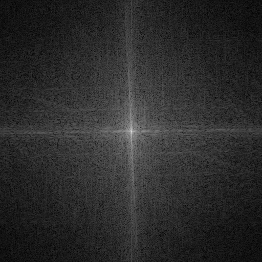

### A Very Simple FFT Library in JAI
 


Example Usage:
```
#import "fft";

example_usage :: () {
    values : [1<<3]float;

    period : float = 128.0;

    for *v : values {
        <<v = cos(it_index * TAU / cast(float)values.count);
        <<v += cos(it_index * TAU / cast(float)values.count * 31);
    }   

    fft_values := fft(values);
    reconstructed := ifft(fft_values);
}

example_image :: () {
    #import "stb_image";
    #import "stb_image_write";

    image : FFT.Image(u8);

    image.data.data = stbi_load("assets/apollo_11_takeoff.jpg", *image.width, *image.height, *image.channel_count, 1);
    image.data.count = image.width * image.height;
    image.channel_count = 1;

    image_u8 := FFT.convert_type(image, float, 1.0 / 255);

    im_fft := FFT.image_fft(image_u8);

    canonical := FFT.to_fft_canonical_form(im_fft);
    canonical_u8 := FFT.convert_type(canonical, u8, 255.0);

    stbi_write_png("assets/apollo_11_fft.png", canonical_u8.width, canonical_u8.height, 1, canonical_u8.data.data, 0);
}


```
